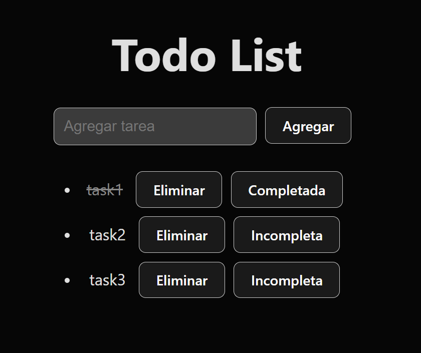

# 🖼️ TodoList ReactJs + Supabase


## 🚀 DEMO
### [Deploy](https://todo-list-react-js-supabase.vercel.app/)

## 💻 Tutorial
<a href='https://youtu.be/V1hZNaL33n8' target='_blank'>
    
</a>

## 📋 Features
- Create tasks
- Delete tasks
- Complete tasks

## 📦 Getting Started
```
git clone https://github.com/garu2/TodoList-ReactJs-Supabase.git
```
```
cd TodoList-ReactJs-Supabase
```
```
npm install
```
```
npm run dev
```
The app will be available at `http://localhost:5173`

## ⚙️ Technologies
* [Vite.js](https://vitejs.dev/)
* [React](https://reactjs.org/)
* [Vercel](https://vercel.com/)
* [Supabase](https://supabase.com/)

